# Tài Liệu API Admin/POS: Cart, Order, Payment

## 1. Mục tiêu và phạm vi

Tài liệu này mô tả contract backend phục vụ hai nhu cầu chính:

- Màn hình `admin quản lý order`
- Màn hình `POS/quầy bán hàng tại cửa hàng cà phê`

Phạm vi chỉ bao gồm ba nhóm API:

- `Cart`
- `Order`
- `Payment`

Tài liệu **không** mở rộng sang `shift`, `shift-assign`, hoặc các module khác.

Nguyên tắc của tài liệu:

- Chỉ mô tả chi tiết request/response khi đã có xác nhận từ backend hoặc sample thực tế.
- Với phần chưa có sample, tài liệu chỉ ghi `endpoint + purpose + flow`, không tự suy đoán field.
- Tài liệu đứng từ góc nhìn frontend admin/POS: API nào dùng để làm gì, gọi lúc nào, dữ liệu nào cần render ở màn hình nào.

## 2. Bản đồ nghiệp vụ cho admin/POS

### 2.1 Luồng tổng quát

```mermaid
flowchart LR
  A["Chọn customer"] --> B["Lấy cart ACTIVE của customer"]
  B --> C["Thêm 1 món hoặc nhiều món vào cart"]
  C --> D["Chỉnh cart item / topping / note"]
  D --> E["Cập nhật info cart: address, phone, message"]
  E --> F["Áp voucher nếu có"]
  F --> G["Checkout cart"]
  G --> H["Sinh order snapshot"]
  H --> I["Tra payment theo order"]
  I --> J["Confirm / refund payment khi cần"]
```



### 2.2 Các thực thể chính

- `ProductFranchise`
  - Đơn vị sản phẩm bán tại một chi nhánh.
  - Được nhận diện bằng `product_franchise_id`.
- `Cart`
  - Giỏ đang thao tác, có thể ở trạng thái `ACTIVE`, `CHECKED_OUT`, `CANCELED`.
- `CartItem`
  - Một line item trong cart.
  - Có thể được cộng dồn quantity hoặc tách thành line mới tùy cấu hình.
- `Option`
  - Trong ngữ cảnh backend hiện tại, `options` chủ yếu là `topping/add-on`.
  - Mỗi option cũng là một `product_franchise_id`.
- `Order`
  - Snapshot được tạo ra từ cart sau khi checkout.
  - Sau khi checkout, order không còn là cart đang chỉnh sửa nữa.
- `Payment`
  - Bản ghi thanh toán gắn với order.

### 2.3 Rule nghiệp vụ đã xác nhận

- Mỗi customer chỉ được tồn tại tối đa `1 cart ACTIVE` tại một thời điểm.
- Admin/POS có thể thêm từng món hoặc thêm nhiều món vào cart `ACTIVE` đó.
- Nếu line item mới giống hệt line item cũ, chỉ khác `quantity`, backend sẽ cộng dồn quantity.
- Nếu khác bất kỳ field nào trong cấu hình line item, ví dụ khác `note` hoặc khác `options`, backend sẽ tạo cart item mới.
- `options` nên được hiểu là topping/add-on, không phải một object cấu hình trừu tượng.
- Cart đã checkout thì không thể cancel nữa.

## 3. Quy ước URL và kiểu GET đặc biệt của backend

Backend này không chỉ dùng pattern REST đơn giản kiểu `/resource/:id`, mà còn có nhiều pattern GET theo `customer`, `cart`, hoặc sub-path `count-*`.

### 3.1 Các pattern chính

| Pattern | Ví dụ | Ý nghĩa implement phía frontend |
| --- | --- | --- |
| `GET /resource/:id` | `GET /api/carts/:id` | Lấy chi tiết một resource cụ thể theo id. |
| `GET /resource/customer/:customerId` | `GET /api/carts/customer/:customerId?status=ACTIVE` | Lấy dữ liệu theo customer, không phải theo cart id trực tiếp. |
| `GET /resource/cart/:cartId` | `GET /api/orders/cart/:cartId` | Dùng cart làm khóa tra cứu order phát sinh từ checkout. |
| `GET /resource/customer/:customerId/count-*` | `GET /api/carts/customer/:customerId/count-cart?status=ACTIVE` | API count dùng sub-path riêng, không phải list rút gọn. |
| `GET /resource/:id/count-*` | `GET /api/carts/:id/count-cart-item` | API đếm theo một resource cụ thể. |
| `GET /resource/code?code=...` | `GET /api/orders/code?code=...` | Tra cứu nhanh theo mã nghiệp vụ. |
| `GET /resource/...?...=...` | `GET /api/orders/customer/:customerId?status=CONFIRMED` | Query như `status` là phần quan trọng của contract; một số endpoint dùng query này theo kiểu tùy chọn. |

### 3.2 Ví dụ URL đầy đủ

- `{{host_main}}/api/carts/customer/699e5b64558e4453d3fce2e3?status=ACTIVE`
- `{{host_main}}/api/carts/customer/699e5b64558e4453d3fce2e3/count-cart?status=ACTIVE`
- `{{host_main}}/api/carts/69b7ac5abbd14c0b1fa077ed/count-cart-item`
- `{{host_main}}/api/orders/cart/69b902b19454696b8f08902e`
- `{{host_main}}/api/orders/customer/699e5b64558e4453d3fce2e3?status=OUT_FOR_DELIVERY`
- `{{host_main}}/api/payments/order/ORDER_OR_PAYMENT_TARGET_ID`

### 3.3 Điều frontend cần chú ý

- Không coi toàn bộ tham số là query string. Nhiều endpoint yêu cầu `path param` bắt buộc.
- `status` là query param, không phải field body.
- Một số GET nhìn giống detail nhưng thực chất trả về `array`, ví dụ `GET /api/carts/customer/:customerId?status=ACTIVE`.
- Các API count là endpoint riêng, không nên dùng list API rồi tự đếm ở client nếu backend đã có API chuyên biệt.

## 4. Enum và các điểm cần normalize

### 4.1 Status enum

#### CartStatus

- `ACTIVE`
- `CHECKED_OUT`
- `CANCELED`

Ghi chú:

- Trong danh sách ban đầu từng có typo `ACITVE`.
- Khi implement frontend phải dùng `ACTIVE` là giá trị đúng.

#### OrderStatus

- `DRAFT`
- `CONFIRMED`
- `PREPARING`
- `READY_FOR_PICKUP`
- `OUT_FOR_DELIVERY`
- `COMPLETED`
- `CANCELED`

#### PaymentStatus

- `PENDING`
- `PAID`
- `REFUNDED`

### 4.2 Các điểm cần normalize ở frontend

- `cart detail` dùng nested object:
  - `product: { name, image_url }`
- `cart list` và `order list/detail` lại thường flatten:
  - `product_name`
  - `product_image_url`
- Frontend cũ có thể đang dùng `CANCELLED`, nhưng backend hiện tại dùng `CANCELED`.
- `PUT /api/carts/items/update-options-cart-item` trả `data: null`, nên frontend không thể trông chờ payload cart mới từ response này.
- `DELETE /api/carts/:cartItemId` tên endpoint dễ gây hiểu nhầm, nhưng theo nghiệp vụ đang dùng để xóa `cart item`, không phải xóa toàn bộ cart.

## 5. Cart APIs

### 5.1 Ma trận endpoint cart

| Mã/nhóm | Method | URL | Quyền theo danh sách backend | Hỗ trợ gì cho admin/POS |
| --- | --- | --- | --- | --- |
| `CART-01` | `POST` | `/api/carts/items/staff` | `SYSTEM & FRANCHISE` | Thêm 1 cart item từ giao diện quản lý/POS. |
| `API mới` | `POST` | `/api/carts/items/staff-bulk` | `SYSTEM & FRANCHISE` | Thêm nhiều cart item trong 1 request cho POS/admin. |
| `CART-02` | `POST` | `/api/carts/items` | `CUSTOMER` | Dành cho storefront khách hàng, không phải trọng tâm tài liệu này. |
| `CART-03` | `GET` | `/api/carts/customer/:customerId?status=...` | `SYSTEM & FRANCHISE, CUSTOMER` | Lấy cart theo customer và status; với POS, trạng thái trung tâm thường là `ACTIVE`. |
| `CART-04` | `GET` | `/api/carts/:id` | `SYSTEM & FRANCHISE, CUSTOMER` | Lấy chi tiết một cart cụ thể. |
| `CART-05` | `GET` | `/api/carts/customer/:customerId/count-cart?status=...` | `SYSTEM & FRANCHISE, CUSTOMER` | Đếm số cart của customer theo status. |
| `CART-06` | `GET` | `/api/carts/:id/count-cart-item` | `CUSTOMER` | Đếm số line item trong cart. Theo usage hiện tại, endpoint này dành cho customer; admin/POS không cần phụ thuộc. |
| `CART-07` | `PUT` | `/api/carts/:id` | `SYSTEM & FRANCHISE, CUSTOMER` | Cập nhật thông tin cart như address, phone, message, info phụ. |
| `CART-08` | `DELETE` | `/api/carts/:cartItemId` | `SYSTEM & FRANCHISE, CUSTOMER` | Xóa một cart item khỏi cart. |
| `CART-09` | `PATCH` | `/api/carts/items/update-option` | `SYSTEM & FRANCHISE, CUSTOMER` | Chỉ cập nhật quantity của option đang có. |
| `API mới` | `PUT` | `/api/carts/items/update-options-cart-item` | `SYSTEM & FRANCHISE, CUSTOMER` | Thay toàn bộ danh sách options của một cart item. |
| `CART-10` | `PATCH` | `/api/carts/items/remove-option` | `SYSTEM & FRANCHISE, CUSTOMER` | Xóa một option khỏi cart item. |
| `CART-11` | `PUT` | `/api/carts/:id/apply-voucher` | `SYSTEM & FRANCHISE, CUSTOMER` | Áp voucher vào cart. |
| `CART-12` | `DELETE` | `/api/carts/:id/remove-voucher` | `SYSTEM & FRANCHISE, CUSTOMER` | Gỡ voucher khỏi cart. |
| `CART-13` | `PUT` | `/api/carts/:id/checkout` | `SYSTEM & FRANCHISE, CUSTOMER` | Checkout cart để sinh order. |
| `CART-14` | `PUT` | `/api/carts/:id/cancel` | `SYSTEM & FRANCHISE, CUSTOMER` | Hủy cart. |

### 5.2 GET APIs của cart

#### 5.2.1 `GET /api/carts/customer/:customerId?status=...`

Ví dụ:

```text
{{host_main}}/api/carts/customer/699e5b64558e4453d3fce2e3?status=ACTIVE
```

**Dùng khi nào**

- Khi mở màn hình POS và cần biết customer hiện tại có cart `ACTIVE` hay chưa.
- Khi cần restore lại cart đang thao tác nếu người dùng quay lại màn hình.
- Khi cần xem lịch sử cart của một customer theo từng status khác nhau.

**Param ở đâu**

- `customerId`: nằm ở `path`
- `status`: nằm ở `query`

**Render gì trên admin/POS**

- Cart sidebar hiện hành
- Danh sách cart lịch sử theo customer
- Chọn cart gần nhất để tiếp tục thao tác

**Điểm quan trọng**

- Dù nghiệp vụ chỉ cho phép tối đa `1 ACTIVE cart`, response của endpoint này là `array`.
- Với `status=ACTIVE`, phía frontend nên chuẩn bị xử lý 3 trường hợp:
  - `[]`: chưa có active cart
  - `[cart]`: có đúng 1 active cart
  - nhiều phần tử: coi là bất thường nghiệp vụ, nên log và chọn quy tắc xử lý rõ ràng
- Khi truyền đúng `status=ACTIVE`, `status=CANCELED`, hoặc `status=CHECKED_OUT`, backend sẽ filter theo status tương ứng.
- Nếu không có cart nào khớp điều kiện filter, backend vẫn trả `200` với `data: []`.
- Với bản chất đây là list endpoint có filter, `200 + []` nên được xem là behavior hợp lý/đúng contract, không phải lỗi backend.

**Sample response đã xác nhận**

- Có sample response thực tế.
- Shape là `success + data[]`.

#### 5.2.2 `GET /api/carts/:id`

Ví dụ:

```text
{{host_main}}/api/carts/69b7ac5abbd14c0b1fa077ed
```

**Dùng khi nào**

- Khi người dùng mở chi tiết một cart cụ thể.
- Khi frontend cần refetch lại cart sau thao tác ghi mà response không trả full cart.
- Khi muốn đồng bộ lại line items, topping, tổng tiền, voucher.

**Param ở đâu**

- `id`: nằm ở `path`

**Render gì trên admin/POS**

- Màn chi tiết cart
- Sidebar cart của POS sau khi refetch
- Review trước checkout

**Sample response đã xác nhận**

- Có sample response thực tế.
- Shape là `success + data`.

#### 5.2.3 `GET /api/carts/customer/:customerId/count-cart?status=...`

Ví dụ:

```text
{{host_main}}/api/carts/customer/699e5b64558e4453d3fce2e3/count-cart?status=ACTIVE
```

**Dùng khi nào**

- Khi cần badge, thống kê nhanh, hoặc kiểm tra customer có bao nhiêu cart theo trạng thái.

**Param ở đâu**

- `customerId`: nằm ở `path`
- `status`: nằm ở `query`

**Render gì trên admin/POS**

- Badge số lượng cart
- Rule check nhanh trước khi thao tác

**Lưu ý**

- Đây là API count riêng, không phải API list.

**Sample response đã xác nhận**

```json
{
  "success": true,
  "data": {
    "count": 3
  }
}
```

#### 5.2.4 `GET /api/carts/:id/count-cart-item`

Ví dụ:

```text
{{host_main}}/api/carts/69b7ac5abbd14c0b1fa077ed/count-cart-item
```

**Dùng khi nào**

- Khi cần số line item trong cart mà không cần load full detail.

**Param ở đâu**

- `id`: nằm ở `path`

**Render gì trên admin/POS**

- Không phải API trọng tâm của admin/POS.
- Nếu có dùng, chủ yếu chỉ để hiển thị badge/count đơn giản.

**Lưu ý**

- Theo tên endpoint, đây là count của `cart item`, không khẳng định là tổng quantity cộng dồn.
- Endpoint này gọi được ở role `CUSTOMER`.
- Admin/POS không cần phụ thuộc vào endpoint này trong luồng chính.

**Sample response đã xác nhận**

```json
{
  "success": true,
  "data": {
    "count": 4
  }
}
```

### 5.3 API ghi dữ liệu của cart

#### 5.3.1 `POST /api/carts/items/staff`

**Hỗ trợ gì**

- Thêm 1 món vào cart từ admin/POS.

**Ghi chú request**

- Backend đã xác nhận `staff-bulk` có cấu trúc tương đương API này, chỉ khác là bản bulk gói nhiều line item vào `items[]`.
- Vì vậy có thể hiểu body của `staff` là phiên bản một line item duy nhất.

**Request body đã được backend xác nhận gián tiếp qua bulk**

```json
{
  "customer_id": "699e5b64558e4453d3fce2e3",
  "franchise_id": "698eab0826ca2b18eb35337e",
  "product_franchise_id": "69abb33e54f63d42311eeecd",
  "quantity": 1,
  "note": "không đá, 30% đường",
  "options": [
    {
      "product_franchise_id": "698eab1a26ca2b18eb3534de",
      "quantity": 1
    }
  ]
}
```

**Response**

- Có sample response kiểu full cart detail.

#### 5.3.2 `POST /api/carts/items/staff-bulk`

**Hỗ trợ gì**

- Thêm nhiều line item vào cart trong một lần bấm.
- Phù hợp khi nhân viên quầy chọn nhanh nhiều món trước khi đồng bộ cart.

**Request body đã xác nhận**

```json
{
  "customer_id": "699e5b64558e4453d3fce2e3",
  "franchise_id": "698eab0826ca2b18eb35337e",
  "items": [
    {
      "product_franchise_id": "69abb33e54f63d42311eeecd",
      "quantity": 1,
      "note": "không đá, 30% đường",
      "options": [
        {
          "product_franchise_id": "698eab1a26ca2b18eb3534de",
          "quantity": 1
        }
      ]
    },
    {
      "product_franchise_id": "69abb33e54f63d42311eeecd",
      "quantity": 1,
      "note": "không đá, 30% đường",
      "options": [
        {
          "product_franchise_id": "698eab1a26ca2b18eb3534de",
          "quantity": 1
        },
        {
          "product_franchise_id": "698eab1a26ca2b18eb3534d4",
          "quantity": 1
        }
      ]
    }
  ]
}
```

**Điểm quan trọng**

- `items[]` chính là danh sách các cart line gửi cùng lúc.
- Mỗi phần tử trong `items[]` tương đương cấu trúc của API add single item.
- API này trả về `full cart detail`, nên frontend có thể dùng response để cập nhật ngay state hiển thị.

**Response sample đã xác nhận**

```json
{
  "success": true,
  "data": {
    "_id": "69bcc4a47981b3e397790df5",
    "customer_id": "699e5b64558e4453d3fce2e3",
    "franchise_id": "698eab0826ca2b18eb35337e",
    "staff_id": "698eab0526ca2b18eb353351",
    "status": "ACTIVE",
    "promotion_discount": 42000,
    "promotion_type": "PERCENT",
    "promotion_value": 15,
    "voucher_discount": 0,
    "loyalty_points_used": 0,
    "loyalty_discount": 0,
    "subtotal_amount": 280000,
    "final_amount": 238000,
    "promotion_id": "69bc1419357970d9876e7f02",
    "franchise_name": "High Land 001",
    "customer_name": "Customer Vip 1",
    "staff_name": "Admin",
    "staff_email": "loinguyenlamthanh@gmail.com",
    "cart_items": [
      {
        "cart_item_id": "69bcc4a47981b3e397790dfa",
        "quantity": 2,
        "product_franchise_id": "69abb33e54f63d42311eeecd",
        "product_cart_price": 50000,
        "discount_amount": 0,
        "line_total": 130000,
        "final_line_total": 130000,
        "options_hash": "698eab1a26ca2b18eb3534de:1",
        "note": "không đá, 30% đường",
        "product": {
          "name": "Coffee 5",
          "image_url": "..."
        },
        "options": [
          {
            "quantity": 1,
            "product_franchise_id": "698eab1a26ca2b18eb3534de",
            "price_snapshot": 15000,
            "discount_amount": 0,
            "final_price": 15000,
            "product": {
              "name": "Bánh plan trứng",
              "image_url": "..."
            }
          }
        ]
      }
    ]
  }
}
```

**Ý nghĩa implement**

- Có thể gọi API này khi POS cho phép chọn sẵn nhiều món rồi mới bấm “thêm vào giỏ”.
- Vì response là full cart detail, state cart ở client có thể cập nhật trực tiếp từ response mà không cần gọi thêm `GET /api/carts/:id`.

#### 5.3.3 `PUT /api/carts/:id`

**Hỗ trợ gì**

- Cập nhật thông tin cart như:
  - `address`
  - `phone`
  - `message`
  - info phụ trước checkout

**Ghi chú**

- Backend đã fix việc info phụ đi qua checkout, nên frontend nên đảm bảo cập nhật các field này trước khi gọi checkout nếu cần.
- Chưa có sample request/response chi tiết cho endpoint này trong tài liệu hiện tại.

#### 5.3.4 `DELETE /api/carts/:cartItemId`

**Hỗ trợ gì**

- Xóa một cart item khỏi cart.

**Param**

- `cartItemId`: nằm ở `path`

**Ghi chú**

- Tên endpoint dễ gây hiểu nhầm thành xóa cart, nhưng theo contract đang dùng là xóa line item.
- Backend đã fix lỗi `not-found-item` từng xảy ra ở luồng delete/change status.

#### 5.3.5 `PUT /api/carts/:id/apply-voucher`

**Hỗ trợ gì**

- Gắn voucher vào cart trước checkout.

**Khi dùng**

- Sau khi cart đã có line items ổn định.
- Trước checkout để backend tính lại `voucher_discount` và `final_amount`.

**Ghi chú**

- Chưa có sample body/response chi tiết trong tài liệu hiện tại.

#### 5.3.6 `DELETE /api/carts/:id/remove-voucher`

**Hỗ trợ gì**

- Gỡ voucher khỏi cart.

**Khi dùng**

- Khi staff muốn bỏ voucher đã áp hoặc đổi sang voucher khác.

**Ghi chú**

- Chưa có sample response chi tiết trong tài liệu hiện tại.

#### 5.3.7 `PUT /api/carts/:id/checkout`

**Hỗ trợ gì**

- Chuyển `cart snapshot` thành `order snapshot`.

**Khi dùng**

- Sau khi cart đã có đủ line items, topping, info phụ, voucher.

**Kết quả nghiệp vụ**

- Một order được sinh ra và có thể tra lại bằng `cartId`.
- Cart không còn thuộc pha có thể cancel như cart chưa checkout.

**Ghi chú**

- Backend đã fix việc truyền info phụ qua checkout.
- Đã có sample response trực tiếp.
- Response của checkout hiện tại là `cart-shaped object`, không phải `order object`.
- Nếu màn hình cần dữ liệu order ngay sau checkout, frontend vẫn nên gọi thêm `GET /api/orders/cart/:cartId`.

**Response sample đã xác nhận**

```json
{
  "success": true,
  "data": {
    "promotion_type": "",
    "promotion_value": 0,
    "voucher_type": "",
    "voucher_value": 0,
    "_id": "69bcd07ab5a8ad90917bc827",
    "customer_id": "69bccf85b5a8ad90917bc7f4",
    "franchise_id": "69ac13c382491f8ce17a11bb",
    "staff_id": "698eab0626ca2b18eb35335d",
    "status": "ACTIVE",
    "promotion_discount": 0,
    "voucher_discount": 0,
    "loyalty_points_used": 0,
    "loyalty_discount": 0,
    "subtotal_amount": 991000,
    "final_amount": 991000,
    "is_active": true,
    "is_deleted": false,
    "created_at": "2026-03-20T04:43:38.921Z",
    "updated_at": "2026-03-20T04:46:10.629Z",
    "__v": 0,
    "address": "quan 2",
    "message": "test lan 1 quoc anh",
    "phone": "0918430155"
  }
}
```

**Điểm cần chú ý khi implement**

- Sample checkout mới nhất backend cung cấp vẫn trả về object theo shape cart.
- Field `status` trong sample response tạm đang là `ACTIVE`, nhưng backend đã đổi state thật sang `CHECKED_OUT`.
- Vì vậy frontend không được tin hoàn toàn vào `status` trong response checkout tức thời.
- Sau checkout nên refetch lại bằng cart/order API để lấy state cuối cùng đã persist.

#### 5.3.8 `PUT /api/carts/:id/cancel`

**Hỗ trợ gì**

- Hủy cart.

**Khi dùng**

- Staff hủy giao dịch trước khi hoặc thay vì checkout.

**Ghi chú**

- Cart đã checkout thì không thể cancel nữa.
- API này chỉ nên hiển thị hoặc cho phép gọi khi cart còn ở pha chưa checkout.

### 5.4 Options = topping/add-on

Đây là phần rất quan trọng với POS.

- `options` hiện tại nên được hiểu là `topping/add-on`.
- Mỗi option là một `product_franchise_id`.
- Vì vậy khi render ở client, có thể map options như một danh sách topping snapshot.

#### 5.4.1 `PUT /api/carts/items/update-options-cart-item`

**Vai trò**

- Thay toàn bộ danh sách options của một cart item.
- Dùng khi staff mở modal chỉnh topping và bấm lưu toàn bộ cấu hình mới.

**Request body đã xác nhận**

```json
{
  "cart_item_id": "69bcc04ff86d6ed3e81641b1",
  "options": [
    {
      "product_franchise_id": "698eab1a26ca2b18eb3534de",
      "quantity": 1
    },
    {
      "product_franchise_id": "698eab1a26ca2b18eb3534d4",
      "quantity": 1
    }
  ]
}
```

**Response đã xác nhận**

```json
{
  "success": true,
  "data": null
}
```

**Ý nghĩa implement**

- Vì response không trả cart mới, frontend nên:
  - refetch lại bằng `GET /api/carts/:id`, hoặc
  - cập nhật local state chủ động nếu đã có logic snapshot rõ ràng

#### 5.4.2 `PATCH /api/carts/items/update-option`

**Vai trò**

- Chỉ cập nhật quantity của option đã tồn tại.
- Không thay toàn bộ list option.

**Khi dùng**

- UI tăng/giảm số lượng của một topping cụ thể.

**Ghi chú**

- Chưa có sample request/response chi tiết mới trong tài liệu hiện tại ngoài việc method là `PATCH`.

#### 5.4.3 `PATCH /api/carts/items/remove-option`

**Vai trò**

- Xóa một option duy nhất khỏi cart item.

**Request body đã xác nhận**

```json
{
  "cart_item_id": "69b2591edfeefd41c8494b26",
  "option_product_franchise_id": "698eab1d26ca2b18eb353515"
}
```

**Khi dùng**

- UI click xóa một topping cụ thể khỏi line item.

### 5.5 Request mẫu đã xác nhận

#### 5.5.1 Add single item cho admin/POS

```json
{
  "customer_id": "699e5b64558e4453d3fce2e3",
  "franchise_id": "698eab0826ca2b18eb35337e",
  "product_franchise_id": "69abb33e54f63d42311eeecd",
  "quantity": 1,
  "note": "không đá, 30% đường",
  "options": [
    {
      "product_franchise_id": "698eab1a26ca2b18eb3534de",
      "quantity": 1
    }
  ]
}
```

Ghi chú:

- Body này được backend xác nhận thông qua rule: `staff-bulk` giống add single item, chỉ khác là line item được đưa vào `items[]`.

#### 5.5.2 Add bulk item cho admin/POS

```json
{
  "customer_id": "699e5b64558e4453d3fce2e3",
  "franchise_id": "698eab0826ca2b18eb35337e",
  "items": [
    {
      "product_franchise_id": "69abb33e54f63d42311eeecd",
      "quantity": 1,
      "note": "không đá, 30% đường",
      "options": [
        {
          "product_franchise_id": "698eab1a26ca2b18eb3534de",
          "quantity": 1
        }
      ]
    }
  ]
}
```

#### 5.5.3 Replace full options cho cart item

```json
{
  "cart_item_id": "69bcc04ff86d6ed3e81641b1",
  "options": [
    {
      "product_franchise_id": "698eab1a26ca2b18eb3534de",
      "quantity": 1
    },
    {
      "product_franchise_id": "698eab1a26ca2b18eb3534d4",
      "quantity": 1
    }
  ]
}
```

#### 5.5.4 Remove one option khỏi cart item

```json
{
  "cart_item_id": "69b2591edfeefd41c8494b26",
  "option_product_franchise_id": "698eab1d26ca2b18eb353515"
}
```

### 5.6 Cấu trúc response cart đã xác nhận

#### 5.6.1 Wrapper chung

| Field | Kiểu | Ý nghĩa |
| --- | --- | --- |
| `success` | `boolean` | Cờ backend trả thành công. |
| `data` | `object` hoặc `array` hoặc `null` | Payload chính. Với detail là object, với list là array, với một số API ghi có thể là `null`. |

#### 5.6.2 Top-level cart fields

| Field | Kiểu | Ý nghĩa |
| --- | --- | --- |
| `_id` | `string` | ID của cart. |
| `customer_id` | `string` | Customer sở hữu cart. |
| `franchise_id` | `string` | Chi nhánh gắn với cart. |
| `staff_id` | `string?` | Staff thao tác, có thể có hoặc không tùy cart. |
| `status` | `string` | Trạng thái cart. |
| `address` | `string?` | Địa chỉ giao hàng nếu có. |
| `phone` | `string?` | Số điện thoại liên hệ nếu có. |
| `message` | `string?` | Ghi chú chung của cart. |
| `promotion_discount` | `number` | Số tiền giảm do promotion. |
| `promotion_type` | `string?` | Loại promotion, ví dụ `PERCENT`. |
| `promotion_value` | `number?` | Giá trị promotion. |
| `voucher_discount` | `number` | Số tiền giảm do voucher. |
| `voucher_type` | `string?` | Loại voucher, ví dụ `FIXED`. |
| `voucher_value` | `number?` | Giá trị voucher. |
| `loyalty_points_used` | `number` | Điểm loyalty đã dùng. |
| `loyalty_discount` | `number` | Số tiền giảm từ loyalty. |
| `subtotal_amount` | `number` | Tổng tiền trước discount cuối cùng. |
| `final_amount` | `number` | Tổng tiền cuối cùng sau các loại giảm. |
| `is_active` | `boolean?` | Cờ active ở layer dữ liệu backend. |
| `is_deleted` | `boolean?` | Cờ soft-delete ở layer dữ liệu backend. |
| `created_at` | `string?` | Thời điểm tạo cart. |
| `updated_at` | `string?` | Thời điểm cập nhật cart gần nhất. |
| `__v` | `number?` | Version field từ Mongo/Mongoose nếu backend trả ra. |
| `promotion_id` | `string?` | Promotion đang áp. |
| `voucher_id` | `string?` | Voucher đang áp. |
| `voucher_code` | `string?` | Mã voucher nếu backend trả ra. |
| `franchise_name` | `string?` | Tên chi nhánh để hiển thị ở admin/POS. |
| `customer_name` | `string?` | Tên customer. |
| `staff_name` | `string?` | Tên staff xử lý. |
| `staff_email` | `string?` | Email staff xử lý. |
| `cart_items` | `array?` | Danh sách line item snapshot trong cart. Có thể vắng mặt ở một số response summary như sample checkout mới nhất. |

#### 5.6.3 Cart item fields

| Field | Kiểu | Ý nghĩa |
| --- | --- | --- |
| `cart_item_id` | `string` | ID của line item trong cart. |
| `quantity` | `number` | Số lượng line item. |
| `product_franchise_id` | `string` | ProductFranchise chính của line item. |
| `product_cart_price` | `number` | Giá snapshot của sản phẩm chính khi vào cart. |
| `discount_amount` | `number` | Giảm giá ở line item. |
| `line_total` | `number` | Tổng tiền line trước final adjustments. |
| `final_line_total` | `number` | Tổng tiền line cuối cùng. |
| `options_hash` | `string` | Chuỗi hash mô tả cấu hình option/topping. |
| `note` | `string` | Ghi chú riêng của line item. |
| `product` | `object?` | Object product dạng nested trong detail/bulk detail. |
| `product_name` | `string?` | Tên sản phẩm dạng flattened trong list payload. |
| `product_image_url` | `string?` | Ảnh sản phẩm dạng flattened trong list payload. |
| `options` | `array` | Danh sách topping/add-on snapshot. |

#### 5.6.4 Cart item option fields

| Field | Kiểu | Ý nghĩa |
| --- | --- | --- |
| `quantity` | `number` | Số lượng topping/add-on. |
| `product_franchise_id` | `string` | ID của topping/add-on. |
| `price_snapshot` | `number` | Giá snapshot của option tại thời điểm thêm vào cart. |
| `discount_amount` | `number` | Giảm giá tại option nếu có. |
| `final_price` | `number` | Giá cuối cùng của option. |
| `product` | `object?` | Object product dạng nested trong detail payload. |
| `product_name` | `string?` | Tên option dạng flattened trong list payload. |
| `product_image_url` | `string?` | Ảnh option dạng flattened trong list payload. |

#### 5.6.5 Khác biệt shape giữa cart detail và cart list

| Loại payload | Cách backend trả product |
| --- | --- |
| `cart detail` | `product: { name, image_url }` |
| `cart list` | `product_name`, `product_image_url` |
| `cart option detail` | `product: { name, image_url }` |
| `cart option list` | `product_name`, `product_image_url` |

Vì vậy phía frontend nên normalize về một model hiển thị thống nhất, không bind trực tiếp UI theo raw field name của mọi endpoint.

#### 5.6.6 Cart list item rút gọn

Ví dụ một phần tử trong `GET /api/carts/customer/:customerId?status=...`:

```json
{
  "_id": "69ba516fc3656dfee3d74605",
  "customer_id": "699e5b64558e4453d3fce2e3",
  "franchise_id": "698eab0826ca2b18eb35337e",
  "status": "CHECKED_OUT",
  "subtotal_amount": 325000,
  "final_amount": 292500,
  "franchise_name": "High Land 001",
  "customer_name": "Customer Vip 1",
  "cart_items": [
    {
      "cart_item_id": "69ba5170c3656dfee3d74608",
      "quantity": 5,
      "product_franchise_id": "69abb33e54f63d42311eeecd",
      "product_cart_price": 50000,
      "line_total": 325000,
      "final_line_total": 325000,
      "options_hash": "698eab1a26ca2b18eb3534de:1",
      "note": "không đá, 30% đường",
      "product_name": "Coffee 5",
      "product_image_url": "...",
      "options": [
        {
          "quantity": 1,
          "product_franchise_id": "698eab1a26ca2b18eb3534de",
          "price_snapshot": 15000,
          "final_price": 15000,
          "product_name": "Bánh plan trứng",
          "product_image_url": "..."
        }
      ]
    }
  ]
}
```

Điểm đáng chú ý:

- Top-level vẫn là cart snapshot.
- Trong list payload, `product` và `option product` thường đã được flatten thành `product_name`, `product_image_url`.
- Khi lọc `status=ACTIVE`, dù backend trả `array`, phía frontend thường kỳ vọng tối đa một phần tử theo rule nghiệp vụ.

## 6. Order APIs

### 6.1 Ma trận endpoint order

| Mã | Method | URL | Quyền theo danh sách backend | Hỗ trợ gì cho admin/POS |
| --- | --- | --- | --- | --- |
| `ORDER-01` | `GET` | `/api/orders/cart/:cartId` | `SYSTEM & FRANCHISE, CUSTOMER` | Lấy order sinh ra từ một cart đã checkout. |
| `ORDER-02` | `GET` | `/api/orders/customer/:customerId?status=...` | `SYSTEM & FRANCHISE, CUSTOMER` | Xem lịch sử order của customer. |
| `ORDER-03` | `GET` | `/api/orders/code?code=...` | `SYSTEM & FRANCHISE, CUSTOMER` | Tra cứu order nhanh bằng mã. |
| `ORDER-04` | `GET` | `/api/orders/:id` | `SYSTEM & FRANCHISE, CUSTOMER` | Mở chi tiết order. |
| `ORDER-05` | `GET` | `/api/orders/franchise/:franchiseId?status=...` | `SYSTEM & FRANCHISE, CUSTOMER` | Staff theo dõi order theo chi nhánh, có thể lọc thêm theo status khi cần. |

### 6.2 GET APIs của order

#### 6.2.1 `GET /api/orders/cart/:cartId`

Ví dụ:

```text
{{host_main}}/api/orders/cart/69b902b19454696b8f08902e
```

**Dùng khi nào**

- Sau khi checkout cart và cần lấy order vừa sinh ra.
- Khi frontend đang giữ `cartId` nhưng chưa biết `orderId`.

**Param ở đâu**

- `cartId`: nằm ở `path`

**Render gì trên admin/POS**

- Màn confirm sau checkout
- Trang chi tiết order
- Màn quản lý trạng thái đơn

**Sample response đã xác nhận**

- Có sample response thực tế.

#### 6.2.2 `GET /api/orders/customer/:customerId?status=...`

Ví dụ:

```text
{{host_main}}/api/orders/customer/699e5b64558e4453d3fce2e3?status=OUT_FOR_DELIVERY
```

**Dùng khi nào**

- Xem lịch sử order của customer.
- Lọc order theo trạng thái để chăm sóc khách hàng hoặc kiểm tra đơn cũ.

**Param ở đâu**

- `customerId`: nằm ở `path`
- `status`: nằm ở `query`

**Render gì trên admin/POS**

- Tab lịch sử order theo customer
- Màn tra cứu lịch sử mua hàng

**Sample response đã xác nhận**

- Có sample response thực tế.

#### 6.2.3 `GET /api/orders/code?code=...`

Ví dụ:

```text
{{host_main}}/api/orders/code?code=ORDER_LCF8FZ2FFU
```

**Dùng khi nào**

- Staff nhập mã order để tra cứu nhanh.

**Param ở đâu**

- `code`: nằm ở `query`

**Render gì trên admin/POS**

- Ô tìm kiếm order theo mã
- Màn hỗ trợ tra cứu đơn tại quầy

**Sample response đã xác nhận**

```json
{
  "success": true,
  "data": {
    "_id": "69b6bc1da948c693cfb53d66",
    "customer_id": "699e5b64558e4453d3fce2e3",
    "franchise_id": "698eab0826ca2b18eb35337e",
    "staff_id": "698eab0526ca2b18eb353351",
    "code": "ORDER_NZIWIYRJCQ",
    "status": "COMPLETED",
    "address": "123",
    "phone": "0938947221",
    "promotion_discount": 6500,
    "voucher_discount": 10000,
    "loyalty_discount": 0,
    "subtotal_amount": 65000,
    "final_amount": 48500,
    "promotion_id": "69b273d5a4c5dff28dac47ac",
    "promotion_type": "PERCENT",
    "promotion_value": 10,
    "voucher_type": "FIXED",
    "voucher_value": 10000,
    "loyalty_points_used": 0,
    "franchise_name": "High Land 001",
    "customer_name": "Customer Vip 1",
    "staff_name": "Admin",
    "staff_email": "loinguyenlamthanh@gmail.com",
    "order_items": [
      {
        "order_item_id": "69b6bc1da948c693cfb53d68",
        "quantity": 1,
        "product_franchise_id": "69abb33e54f63d42311eeecd",
        "price_snapshot": 50000,
        "discount_amount": 0,
        "line_total": 65000,
        "final_line_total": 65000,
        "options_hash": "698eab1a26ca2b18eb3534de:1",
        "product_name": "Coffee 5",
        "product_image_url": "...",
        "options": [
          {
            "quantity": 1,
            "product_franchise_id": "698eab1a26ca2b18eb3534de",
            "price_snapshot": 15000,
            "discount_amount": 0,
            "final_price": 15000,
            "product_name": "Bánh plan trứng",
            "product_image_url": "..."
          }
        ]
      }
    ]
  }
}
```

**Ghi chú**

- `GET /api/orders/code?code=...` trả về order detail shape.
- Sample này cho thấy payload có thể bao gồm đầy đủ thông tin promotion, voucher, staff, và order items.

#### 6.2.4 `GET /api/orders/:id`

Ví dụ:

```text
{{host_main}}/api/orders/69b908b496df2c6c678cf547
```

**Dùng khi nào**

- Khi đã có `orderId` và cần detail trực tiếp.

**Param ở đâu**

- `id`: nằm ở `path`

**Render gì trên admin/POS**

- Drawer/modal/trang detail order

**Sample response đã xác nhận**

- Có sample response riêng cho endpoint này.
- Shape detail gần như trùng với `GET /api/orders/cart/:cartId`, chỉ không thấy `cart_id` trong sample mới bạn gửi.

#### 6.2.5 `GET /api/orders/franchise/:franchiseId?status=...`

Ví dụ:

```text
{{host_main}}/api/orders/franchise/698eab0826ca2b18eb353384
```

**Dùng khi nào**

- Staff của chi nhánh cần load danh sách order theo franchise.
- Màn quản lý order của quầy, bếp, hoặc giao hàng nội bộ.

**Param ở đâu**

- `franchiseId`: nằm ở `path`
- `status`: nằm ở `query`, dùng khi cần lọc; sample mới cho thấy endpoint vẫn gọi được cả khi không truyền query này

**Render gì trên admin/POS**

- Bảng order theo chi nhánh
- Các cột filter trạng thái order

**Sample response đã xác nhận**

```json
{
  "success": true,
  "data": [
    {
      "_id": "69b908b496df2c6c678cf547",
      "code": "ORDER_LCF8FZ2FFU",
      "status": "OUT_FOR_DELIVERY",
      "phone": "0938947221",
      "subtotal_amount": 79000,
      "final_amount": 63200,
      "created_at": "2026-03-17T07:54:28.202Z"
    },
    {
      "_id": "69bb7e9fe1d19ff0cdb25cd1",
      "code": "ORDER_NM5N3OKE59",
      "status": "CONFIRMED",
      "phone": "0938947221",
      "subtotal_amount": 67000,
      "final_amount": 53600,
      "created_at": "2026-03-19T04:42:07.565Z"
    }
  ]
}
```

### 6.3 Cấu trúc response order đã xác nhận

#### 6.3.1 Order detail rút gọn

Ví dụ từ `GET /api/orders/cart/:cartId`:

```json
{
  "_id": "69b908b496df2c6c678cf547",
  "customer_id": "699e5b64558e4453d3fce2e3",
  "franchise_id": "698eab0826ca2b18eb353384",
  "cart_id": "69b902b19454696b8f08902e",
  "code": "ORDER_LCF8FZ2FFU",
  "status": "OUT_FOR_DELIVERY",
  "address": "1234567890",
  "phone": "0938947221",
  "message": "nhớ giao giờ hành chính",
  "promotion_discount": 15800,
  "voucher_discount": 0,
  "loyalty_discount": 0,
  "subtotal_amount": 79000,
  "final_amount": 63200,
  "franchise_name": "Trung Nguyen 001",
  "customer_name": "Customer Vip 1",
  "order_items": [
    {
      "order_item_id": "69b908b496df2c6c678cf549",
      "quantity": 1,
      "product_franchise_id": "698eab1b26ca2b18eb3534e3",
      "price_snapshot": 32000,
      "line_total": 47000,
      "final_line_total": 47000,
      "options_hash": "698eab1d26ca2b18eb353515:1",
      "product_name": "Espresso",
      "product_image_url": "...",
      "options": [
        {
          "quantity": 1,
          "product_franchise_id": "698eab1d26ca2b18eb353515",
          "price_snapshot": 15000,
          "final_price": 15000,
          "product_name": "Trân châu đen",
          "product_image_url": "..."
        }
      ]
    }
  ]
}
```

Ghi chú:

- `GET /api/orders/:id` hiện có sample riêng và shape gần như tương đương order detail ở trên.
- Điểm khác biệt quan sát được trong sample mới là không thấy `cart_id` xuất hiện trong payload detail theo `orderId`.

#### 6.3.2 Top-level order fields

| Field | Kiểu | Ý nghĩa |
| --- | --- | --- |
| `_id` | `string` | ID của order. |
| `customer_id` | `string` | Customer đặt đơn. |
| `franchise_id` | `string` | Chi nhánh xử lý đơn. |
| `staff_id` | `string?` | Staff tạo/xử lý đơn, nếu có. |
| `cart_id` | `string?` | Cart nguồn sinh ra order. |
| `code` | `string` | Mã order để tra cứu nhanh. |
| `status` | `string` | Trạng thái order. |
| `address` | `string?` | Địa chỉ giao hàng nếu có. |
| `phone` | `string?` | Số điện thoại liên hệ. |
| `message` | `string?` | Ghi chú order. |
| `promotion_discount` | `number` | Số tiền giảm từ promotion. |
| `voucher_discount` | `number` | Số tiền giảm từ voucher. |
| `loyalty_discount` | `number` | Số tiền giảm từ loyalty. |
| `subtotal_amount` | `number` | Tổng tiền snapshot trước các giảm giá cuối. |
| `final_amount` | `number` | Tổng tiền cuối cùng của order. |
| `promotion_id` | `string?` | Promotion được áp. |
| `promotion_type` | `string?` | Loại promotion. |
| `promotion_value` | `number?` | Giá trị promotion. |
| `voucher_type` | `string?` | Loại voucher. |
| `voucher_value` | `number?` | Giá trị voucher. |
| `loyalty_points_used` | `number` | Số điểm loyalty đã dùng. |
| `created_at` | `string?` | Thời điểm tạo order nếu backend trả ra. |
| `updated_at` | `string?` | Thời điểm cập nhật order nếu backend trả ra. |
| `franchise_name` | `string?` | Tên chi nhánh. |
| `customer_name` | `string?` | Tên customer. |
| `staff_name` | `string?` | Tên staff. |
| `staff_email` | `string?` | Email staff. |
| `order_items` | `array` | Snapshot line items của order. |

#### 6.3.3 Order item fields

| Field | Kiểu | Ý nghĩa |
| --- | --- | --- |
| `order_item_id` | `string` | ID line item trong order. |
| `quantity` | `number` | Số lượng của line item. |
| `product_franchise_id` | `string` | ProductFranchise chính của line item. |
| `price_snapshot` | `number` | Giá snapshot sản phẩm chính. |
| `discount_amount` | `number` | Giảm giá line item. |
| `line_total` | `number` | Tổng tiền line item. |
| `final_line_total` | `number` | Tổng cuối cùng của line item. |
| `options_hash` | `string` | Hash mô tả topping/config tại thời điểm snapshot. |
| `product_name` | `string` | Tên sản phẩm chính. |
| `product_image_url` | `string` | Ảnh sản phẩm chính. |
| `options` | `array` | Danh sách topping/add-on snapshot. |

#### 6.3.4 Order item option fields

| Field | Kiểu | Ý nghĩa |
| --- | --- | --- |
| `quantity` | `number` | Số lượng option/topping. |
| `product_franchise_id` | `string` | ID option/topping. |
| `price_snapshot` | `number` | Giá snapshot option. |
| `discount_amount` | `number` | Giảm giá option nếu có. |
| `final_price` | `number` | Giá cuối cùng của option. |
| `product_name` | `string` | Tên option. |
| `product_image_url` | `string` | Ảnh option. |

#### 6.3.5 Order list item rút gọn

Ví dụ một phần tử trong `GET /api/orders/customer/:customerId?status=...`:

```json
{
  "_id": "69ba51c4c3656dfee3d7463a",
  "customer_id": "699e5b64558e4453d3fce2e3",
  "franchise_id": "698eab0826ca2b18eb35337e",
  "code": "ORDER_UM07GH86A",
  "status": "COMPLETED",
  "subtotal_amount": 325000,
  "final_amount": 292500,
  "franchise_name": "High Land 001",
  "customer_name": "Customer Vip 1",
  "order_items": [
    {
      "order_item_id": "69ba51c4c3656dfee3d7463c",
      "quantity": 5,
      "product_franchise_id": "69abb33e54f63d42311eeecd",
      "price_snapshot": 50000,
      "line_total": 325000,
      "final_line_total": 325000,
      "options_hash": "698eab1a26ca2b18eb3534de:1",
      "product_name": "Coffee 5",
      "product_image_url": "...",
      "options": [
        {
          "quantity": 1,
          "product_franchise_id": "698eab1a26ca2b18eb3534de",
          "price_snapshot": 15000,
          "final_price": 15000,
          "product_name": "Bánh plan trứng",
          "product_image_url": "..."
        }
      ]
    }
  ]
}
```

#### 6.3.6 Order list theo franchise rút gọn

Ví dụ một phần tử trong `GET /api/orders/franchise/:franchiseId?status=...`:

```json
{
  "_id": "69b908b496df2c6c678cf547",
  "code": "ORDER_LCF8FZ2FFU",
  "status": "OUT_FOR_DELIVERY",
  "phone": "0938947221",
  "subtotal_amount": 79000,
  "final_amount": 63200,
  "created_at": "2026-03-17T07:54:28.202Z"
}
```

Ghi chú:

- `GET /api/orders/customer/:customerId?status=...` hiện trả list khá giàu dữ liệu, gần với order detail.
- `GET /api/orders/franchise/:franchiseId?status=...` lại trả list mỏng hơn, thiên về dashboard/board xử lý đơn.
- Vì vậy frontend không nên giả định mọi “order list” đều có cùng shape.

### 6.4 Điều quan trọng khi implement order

- Order là snapshot sau checkout.
- Không nên dùng UI order như một cart đang chỉnh trực tiếp.
- Quan hệ cơ bản:
  - `cart_id` dùng để truy ngược order phát sinh từ checkout
  - `code` dùng để tìm kiếm nhanh
  - `status` dùng để điều phối vận hành

## 7. Payment APIs (Tạm thời / TODO)

> TODO: Phần payment tạm thời chưa chốt làm contract cuối cho frontend admin/POS.
> 
> Hiện tại chỉ nên xem đây là phần tham khảo sơ bộ hoặc để chuẩn bị integration sau.
> Nếu backend thay đổi tiếp, ưu tiên cập nhật lại phần này sau cùng.

### 7.1 Ma trận endpoint payment

| Mã | Method | URL | Quyền theo danh sách backend | Hỗ trợ gì cho admin/POS |
| --- | --- | --- | --- | --- |
| `PAYMENT-01` | `GET` | `/api/payments/order/:orderId` | `SYSTEM & FRANCHISE, CUSTOMER` | Lấy payment theo order. |
| `PAYMENT-02` | `GET` | `/api/payments/customer/:customerId` | `SYSTEM & FRANCHISE, CUSTOMER` | Lấy payment theo customer. |
| `PAYMENT-03` | `GET` | `/api/payments/code?code=` | `SYSTEM & FRANCHISE, CUSTOMER` | Tra payment theo code. |
| `PAYMENT-04` | `GET` | `/api/payments/:id` | `SYSTEM & FRANCHISE, CUSTOMER` | Mở payment detail theo id. |
| `PAYMENT-05` | `PUT` | `/api/payments/:id/confirm` | `SYSTEM & FRANCHISE, CUSTOMER` | Xác nhận thanh toán. |
| `PAYMENT-06` | `PUT` | `/api/payments/:id/refund` | `SYSTEM & FRANCHISE, CUSTOMER` | Hoàn tiền. |

### 7.2 Cách hiểu từng API payment trong admin/POS

#### 7.2.1 `GET /api/payments/order/:orderId`

**Dùng khi nào**

- Khi đang đứng ở order detail và cần kiểm tra payment tương ứng.

**Param ở đâu**

- `orderId`: nằm ở `path`

**Render gì**

- Payment card trong order detail
- Trạng thái đã thanh toán/chưa thanh toán

**Sample response đã xác nhận**

```json
{
  "success": true,
  "data": {
    "_id": "69bcdbf8378d2fa486866262",
    "franchise_id": "69ac13c382491f8ce17a11bb",
    "customer_id": "69bccf85b5a8ad90917bc7f4",
    "order_id": "69bcdbf7378d2fa486866253",
    "code": "PAYMENT_J0HQ4MCA",
    "method": "",
    "status": "PENDING",
    "amount": 991000,
    "is_active": true,
    "is_deleted": false,
    "created_at": "2026-03-20T05:32:40.124Z",
    "updated_at": "2026-03-20T05:32:40.124Z",
    "__v": 0
  }
}
```

#### 7.2.2 `GET /api/payments/customer/:customerId`

**Dùng khi nào**

- Khi muốn tra lịch sử thanh toán của customer.

**Param ở đâu**

- `customerId`: nằm ở `path`

**Render gì**

- Lịch sử payment theo customer

**Sample response đã xác nhận**

```json
{
  "success": true,
  "data": [
    {
      "_id": "69ba51c5c3656dfee3d74643",
      "franchise_id": "698eab0826ca2b18eb35337e",
      "customer_id": "699e5b64558e4453d3fce2e3",
      "order_id": "69ba51c4c3656dfee3d7463a",
      "code": "PAYMENT_TH6IDLGE2",
      "method": "CARD",
      "status": "PAID",
      "amount": 292500,
      "is_active": true,
      "is_deleted": false,
      "created_at": "2026-03-18T07:18:29.244Z",
      "updated_at": "2026-03-18T07:18:29.244Z",
      "__v": 0,
      "paid_at": "2026-03-18T07:20:24.944Z"
    }
  ]
}
```

#### 7.2.3 `GET /api/payments/code?code=...`

**Dùng khi nào**

- Tra nhanh payment bằng mã.

**Param ở đâu**

- `code`: nằm ở `query`

**Render gì**

- Ô tìm kiếm payment theo mã

**Lưu ý**

- Chưa có sample response xác nhận shape.

#### 7.2.4 `GET /api/payments/:id`

**Dùng khi nào**

- Khi đã có `paymentId` và cần detail chính xác.

**Param ở đâu**

- `id`: nằm ở `path`

**Render gì**

- Payment detail modal/page

**Lưu ý**

- Chưa có sample response xác nhận shape.

#### 7.2.5 `PUT /api/payments/:id/confirm`

**Dùng khi nào**

- Sau khi quầy xác nhận khách đã thanh toán.
- Phù hợp cho luồng POS, QR, tiền mặt, hoặc hình thức xác nhận thủ công tùy hệ thống.

**Param ở đâu**

- `id`: nằm ở `path`

**Kết quả nghiệp vụ**

- Payment status dự kiến chuyển sang `PAID`.

**Request body đã xác nhận**

```json
{
  "method": "CARD",
  "providerTxnId": ""
}
```

**Lưu ý**

- Chưa có sample response xác nhận shape.

#### 7.2.6 `PUT /api/payments/:id/refund`

**Dùng khi nào**

- Khi cần hoàn tiền cho order đã thanh toán.

**Param ở đâu**

- `id`: nằm ở `path`

**Kết quả nghiệp vụ**

- Payment status dự kiến chuyển sang `REFUNDED`.

**Request body đã xác nhận**

```json
{
  "refund_reason": "khong mua nua"
}
```

**Lưu ý**

- Chưa có sample response xác nhận shape.

### 7.3 Cấu trúc response payment đã xác nhận

#### 7.3.1 Payment detail rút gọn

Ví dụ từ `GET /api/payments/order/:orderId`:

```json
{
  "_id": "69bcdbf8378d2fa486866262",
  "franchise_id": "69ac13c382491f8ce17a11bb",
  "customer_id": "69bccf85b5a8ad90917bc7f4",
  "order_id": "69bcdbf7378d2fa486866253",
  "code": "PAYMENT_J0HQ4MCA",
  "method": "",
  "status": "PENDING",
  "amount": 991000,
  "is_active": true,
  "is_deleted": false,
  "created_at": "2026-03-20T05:32:40.124Z",
  "updated_at": "2026-03-20T05:32:40.124Z",
  "__v": 0
}
```

#### 7.3.2 Payment list item rút gọn

Ví dụ một phần tử trong `GET /api/payments/customer/:customerId`:

```json
{
  "_id": "69ba51c5c3656dfee3d74643",
  "franchise_id": "698eab0826ca2b18eb35337e",
  "customer_id": "699e5b64558e4453d3fce2e3",
  "order_id": "69ba51c4c3656dfee3d7463a",
  "code": "PAYMENT_TH6IDLGE2",
  "method": "CARD",
  "status": "PAID",
  "amount": 292500,
  "is_active": true,
  "is_deleted": false,
  "created_at": "2026-03-18T07:18:29.244Z",
  "updated_at": "2026-03-18T07:18:29.244Z",
  "__v": 0,
  "paid_at": "2026-03-18T07:20:24.944Z"
}
```

#### 7.3.3 Top-level payment fields

| Field | Kiểu | Ý nghĩa |
| --- | --- | --- |
| `_id` | `string` | ID của payment. |
| `franchise_id` | `string` | Chi nhánh gắn với payment. |
| `customer_id` | `string` | Customer của payment. |
| `order_id` | `string` | Order gốc. |
| `code` | `string` | Mã payment để tra cứu nhanh. |
| `method` | `string` | Phương thức thanh toán. Có thể rỗng khi payment còn pending. |
| `status` | `string` | Trạng thái payment. |
| `amount` | `number` | Số tiền thanh toán. |
| `is_active` | `boolean` | Cờ active ở layer dữ liệu backend. |
| `is_deleted` | `boolean` | Cờ soft-delete. |
| `created_at` | `string` | Thời điểm tạo payment. |
| `updated_at` | `string` | Thời điểm cập nhật payment. |
| `__v` | `number` | Version field từ Mongo/Mongoose nếu backend trả ra. |
| `paid_at` | `string?` | Thời điểm thanh toán thành công. Chỉ có ở các payment đã paid. |

#### 7.3.4 Điều frontend cần chú ý với payment

- `method` có thể là chuỗi rỗng khi payment mới tạo hoặc còn `PENDING`.
- `paid_at` không xuất hiện ở payment chưa thanh toán.
- `GET /api/payments/order/:orderId` trả về detail object.
- `GET /api/payments/customer/:customerId` trả về list array.

## 8. Cách dùng API để làm màn hình admin/POS

### 8.1 Luồng chuẩn cho màn POS/quầy bán hàng

#### Bước 1: xác định customer

- Chọn customer hiện tại hoặc gắn customer với phiên bán hàng.
- Giữ `customer_id` làm khóa chính để làm việc với cart.

#### Bước 2: load cart đang mở

Gọi:

```text
GET /api/carts/customer/:customerId?status=ACTIVE
```

Mục đích:

- Kiểm tra customer đã có `ACTIVE cart` chưa.
- Restore cart cũ nếu đang dang dở.

#### Bước 3: thêm món vào cart

Nếu thêm từng món:

```text
POST /api/carts/items/staff
```

Nếu thêm nhiều món trong một lần:

```text
POST /api/carts/items/staff-bulk
```

Áp dụng rule backend:

- cùng cấu hình hoàn toàn -> cộng dồn quantity
- khác `note` hoặc khác `options` -> tạo line mới

#### Bước 4: chỉnh topping/options

Khi staff chỉnh toàn bộ list topping:

```text
PUT /api/carts/items/update-options-cart-item
```

Khi staff chỉ tăng/giảm số lượng một topping:

```text
PATCH /api/carts/items/update-option
```

Khi staff xóa một topping:

```text
PATCH /api/carts/items/remove-option
```

#### Bước 5: đồng bộ lại cart

Vì không phải API ghi nào cũng trả full cart, frontend nên có chiến lược rõ:

- Nếu vừa gọi `POST /api/carts/items/staff-bulk`, có thể cập nhật state trực tiếp từ response.
- Nếu vừa gọi `PUT /api/carts/items/update-options-cart-item`, nên refetch cart.
- Với các API PATCH option khác, nếu chưa có contract response chắc chắn ở frontend, nên refetch để tránh lệch state.

API refetch nên dùng:

- `GET /api/carts/:id`
- hoặc `GET /api/carts/customer/:customerId?status=ACTIVE`

#### Bước 6: cập nhật info phụ và voucher

- Update info cart qua `PUT /api/carts/:id`
- Áp voucher qua `PUT /api/carts/:id/apply-voucher`
- Gỡ voucher qua `DELETE /api/carts/:id/remove-voucher`

#### Bước 7: checkout

Gọi:

```text
PUT /api/carts/:id/checkout
```

Kỳ vọng nghiệp vụ:

- Order được sinh ra
- Cart không còn thuộc pha có thể cancel như cart chưa checkout
- Info phụ như `address`, `phone`, `message` đi qua checkout đúng như backend đã fix
- Checkout response hiện là cart-shaped object và có thể chưa phản ánh state cuối cùng, nên nếu cần dữ liệu chuẩn thì phải gọi thêm `GET /api/orders/cart/:cartId`

#### Bước 8: lấy order phát sinh

Nếu đang giữ `cartId`:

```text
GET /api/orders/cart/:cartId
```

Nếu đã có `orderId`:

```text
GET /api/orders/:id
```

Nếu cần tra nhanh:

```text
GET /api/orders/code?code=...
```

#### Bước 9: theo dõi và xử lý payment

- `GET /api/payments/order/:orderId`
- `PUT /api/payments/:id/confirm`
- `PUT /api/payments/:id/refund`

### 8.2 Luồng chuẩn cho màn quản lý order

#### Danh sách order theo chi nhánh

```text
GET /api/orders/franchise/:franchiseId?status=...
```

Dùng để:

- load order của chi nhánh
- chia tab theo trạng thái
- staff xử lý đơn theo vận hành nội bộ

#### Mở detail order

```text
GET /api/orders/:id
```

hoặc

```text
GET /api/orders/cart/:cartId
```

#### Tra cứu nhanh order

```text
GET /api/orders/code?code=...
```

#### Tra payment của order

```text
GET /api/payments/order/:orderId
```

## 9. Model tài liệu hóa để frontend admin/POS dễ map

Các model dưới đây là `model chuẩn hóa trong tài liệu`, không phải code backend và cũng chưa phải code đã implement trong repo.

### 9.1 Request models

```ts
export interface AdminCartItemOptionInput {
  product_franchise_id: string
  quantity: number
}

export interface AdminStaffAddToCartRequest {
  customer_id: string
  franchise_id: string
  product_franchise_id: string
  quantity: number
  note?: string
  options?: AdminCartItemOptionInput[]
}

export interface AdminBulkCartItemInput {
  product_franchise_id: string
  quantity: number
  note?: string
  options?: AdminCartItemOptionInput[]
}

export interface AdminStaffBulkAddToCartRequest {
  customer_id: string
  franchise_id: string
  items: AdminBulkCartItemInput[]
}

export interface AdminReplaceCartItemOptionsRequest {
  cart_item_id: string
  options: AdminCartItemOptionInput[]
}

export interface AdminRemoveCartItemOptionRequest {
  cart_item_id: string
  option_product_franchise_id: string
}

export interface AdminConfirmPaymentRequest {
  method: string
  providerTxnId: string
}

export interface AdminRefundPaymentRequest {
  refund_reason: string
}
```

### 9.2 Read models

Ghi chú:

- `AdminOrderListItem` đại diện cho list kiểu “giàu dữ liệu”, gần với customer order history.
- `AdminFranchiseOrderListItem` đại diện cho list kiểu “mỏng”, gần với dashboard/board order theo chi nhánh.
- `AdminPaymentDetail` và `AdminPaymentListItem` bên dưới hiện chỉ nên xem là model tham khảo tạm thời.
- Phần payment vẫn đang để `TODO / chưa chốt`, nên nếu backend đổi tiếp thì phải ưu tiên cập nhật lại model này sau.

```ts
export interface AdminCartItemOption {
  product_franchise_id: string
  quantity: number
  price_snapshot: number
  discount_amount: number
  final_price: number
  product_name?: string
  product_image_url?: string
}

export interface AdminCartItem {
  cart_item_id: string
  quantity: number
  product_franchise_id: string
  product_cart_price: number
  discount_amount: number
  line_total: number
  final_line_total: number
  options_hash: string
  note?: string
  product_name?: string
  product_image_url?: string
  options: AdminCartItemOption[]
}

export interface AdminCartDetail {
  _id: string
  customer_id: string
  franchise_id: string
  staff_id?: string
  status: "ACTIVE" | "CHECKED_OUT" | "CANCELED"
  address?: string
  phone?: string
  message?: string
  promotion_discount: number
  promotion_type?: string
  promotion_value?: number
  voucher_discount: number
  voucher_type?: string
  voucher_value?: number
  loyalty_points_used: number
  loyalty_discount: number
  subtotal_amount: number
  final_amount: number
  is_active?: boolean
  is_deleted?: boolean
  created_at?: string
  updated_at?: string
  __v?: number
  promotion_id?: string
  voucher_id?: string
  voucher_code?: string
  franchise_name?: string
  customer_name?: string
  staff_name?: string
  staff_email?: string
  cart_items?: AdminCartItem[]
}

export interface AdminCartListItem extends AdminCartDetail {}

export interface AdminOrderDetail {
  _id: string
  customer_id: string
  franchise_id: string
  staff_id?: string
  cart_id?: string
  code: string
  status:
    | "DRAFT"
    | "CONFIRMED"
    | "PREPARING"
    | "READY_FOR_PICKUP"
    | "OUT_FOR_DELIVERY"
    | "COMPLETED"
    | "CANCELED"
  address?: string
  phone?: string
  message?: string
  promotion_discount: number
  voucher_discount: number
  loyalty_discount: number
  subtotal_amount: number
  final_amount: number
  promotion_id?: string
  promotion_type?: string
  promotion_value?: number
  voucher_type?: string
  voucher_value?: number
  loyalty_points_used: number
  created_at?: string
  updated_at?: string
  franchise_name?: string
  customer_name?: string
  staff_name?: string
  staff_email?: string
  order_items: Array<{
    order_item_id: string
    quantity: number
    product_franchise_id: string
    price_snapshot: number
    discount_amount: number
    line_total: number
    final_line_total: number
    options_hash: string
    product_name?: string
    product_image_url?: string
    options: AdminCartItemOption[]
  }>
}

export interface AdminOrderListItem extends AdminOrderDetail {}

export interface AdminFranchiseOrderListItem {
  _id: string
  code: string
  status:
    | "DRAFT"
    | "CONFIRMED"
    | "PREPARING"
    | "READY_FOR_PICKUP"
    | "OUT_FOR_DELIVERY"
    | "COMPLETED"
    | "CANCELED"
  phone?: string
  subtotal_amount: number
  final_amount: number
  created_at?: string
}

export interface AdminPaymentDetail {
  _id: string
  franchise_id: string
  customer_id: string
  order_id: string
  code: string
  method: string
  status: "PENDING" | "PAID" | "REFUNDED"
  amount: number
  is_active: boolean
  is_deleted: boolean
  created_at: string
  updated_at: string
  __v?: number
  paid_at?: string
}

export interface AdminPaymentListItem extends AdminPaymentDetail {}
```

## 10. Những gì hiện tại trong repo chưa phản ánh đúng contract backend mới

Các file hiện tại chỉ nên xem là context cũ hoặc mock UI:

- [src/types/cart.type.ts](../src/types/cart.type.ts)
- [src/types/order.type.ts](../src/types/order.type.ts)
- [src/modules/admin/order-management/pages/OrderManagement.tsx](../src/modules/admin/order-management/pages/OrderManagement.tsx)

Những điểm chưa khớp đáng chú ý:

- Type cart/order hiện tại còn đơn giản hơn nhiều so với payload backend thật.
- Màn `OrderManagement` hiện vẫn đang đi theo mock state nội bộ, chưa phản ánh flow cart/order/payment thực tế từ backend.
- Frontend cũ chưa thể dùng trực tiếp raw response mà không normalize.

## 11. Checklist khi implement frontend admin/POS

- Build URL đúng với `path param + query param`.
- Không assume `GET by customer` sẽ trả object; có endpoint trả `array`.
- Tách rõ 3 thao tác option:
  - replace full list
  - update quantity
  - remove one option
- Đừng bind UI theo raw shape detail/list lẫn lộn; cần normalize `product.name` và `product_name`.
- Sau các API trả `data: null`, chủ động refetch hoặc patch local state.
- Với các API chưa có sample response xác nhận, đừng hard-code field cho tới khi nhận payload thật từ backend.

## 12. Tóm tắt nhanh những API quan trọng nhất cho POS

Nếu chỉ nhìn từ góc độ làm máy POS, các API quan trọng nhất là:

1. `GET /api/carts/customer/:customerId?status=ACTIVE`
   - API trung tâm để biết quầy đang thao tác trên cart nào.
2. `POST /api/carts/items/staff`
   - Thêm một món vào cart.
3. `POST /api/carts/items/staff-bulk`
   - Thêm nhiều món trong một lần, rất phù hợp cho POS.
4. `PUT /api/carts/items/update-options-cart-item`
   - Lưu lại toàn bộ topping mới của một line item.
5. `GET /api/carts/:id`
   - Refetch cart detail để đồng bộ UI.
6. `PUT /api/carts/:id`
   - Ghi info phụ trước checkout.
7. `PUT /api/carts/:id/checkout`
   - Chốt cart thành order.
8. `GET /api/orders/cart/:cartId`
   - Lấy order vừa phát sinh sau checkout.
9. `GET /api/payments/order/:orderId`
   - Xem payment của order.
10. `PUT /api/payments/:id/confirm`
   - Xác nhận khách đã thanh toán.
